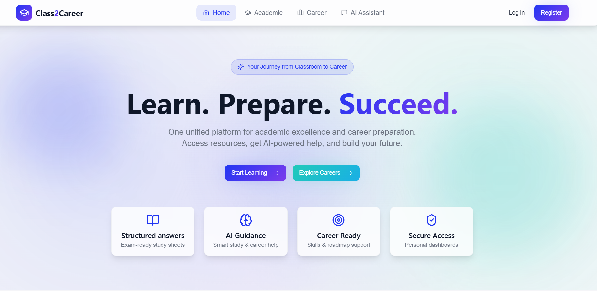
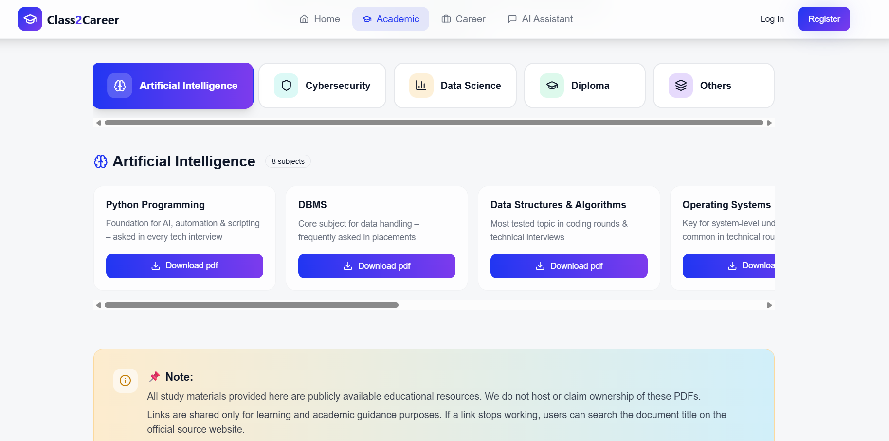
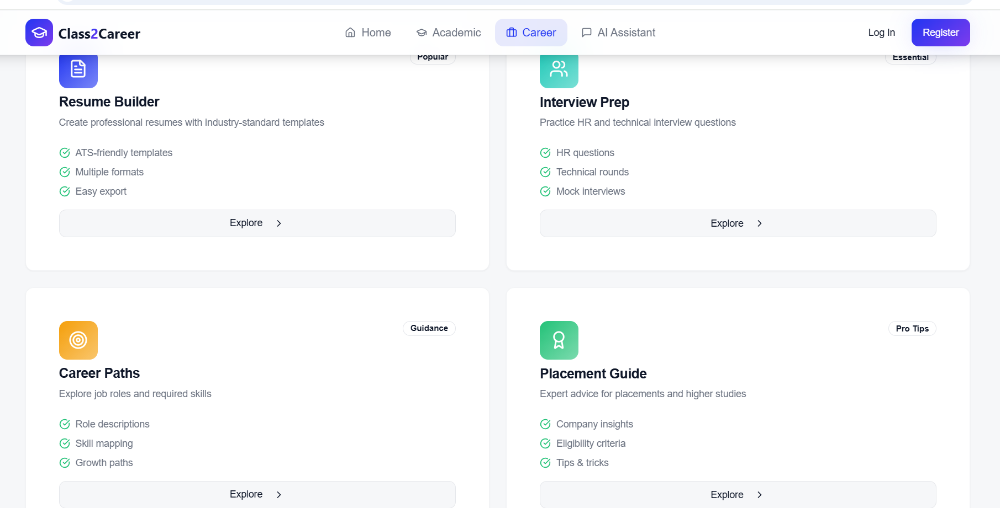
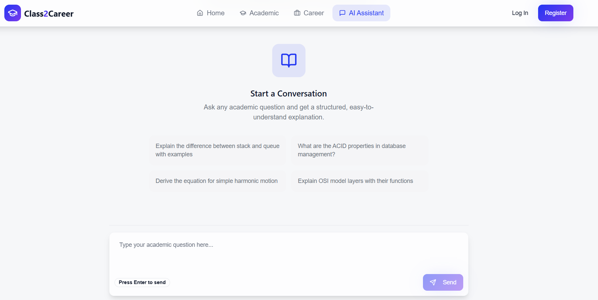

# Class2Career

Class2Career is a student-focused web platform that brings academic resources and career guidance together in one place. It is designed to help students explore learning resources, career paths, and placement preparation materials through a simple and user-friendly interface.

## 🚀 Live Demo

[Visit Class2Career](https://class2-career.vercel.app/)

## ✨ Features

-  Access academic learning resources
-  Explore career paths and required skills
-  Resume-building resources
-  Placement preparation resources
-  Interview preparation resources
-  Easy resource discovery and navigation
-  Responsive and user-friendly interface

## 🛠️ Technologies Used

- React.js
- TypeScript
- JavaScript
- HTML5
- CSS3
- Tailwind CSS
- Supabase
- Vercel

## 🎯 Project Objective

The goal of Class2Career is to provide students with a centralized platform for accessing academic resources and career preparation materials instead of searching across multiple platforms.

## 📸 Screenshots

### Home Page

### Resources

### Career Paths

## ai assistant 

## 💡 What I Learned

Through this project, I gained practical experience in:

- Developing responsive web applications using React and TypeScript
- Building reusable UI components
- Integrating frontend applications with Supabase
- Managing project data and application functionality
- Using Git and GitHub for version control
- Deploying web applications using Vercel
- Designing interfaces with a focus on usability

## 🔮 Future Improvements

- User authentication and personalized dashboards
- Expanded career roadmaps
- Personalized learning recommendations
- Advanced search and filtering
- Student progress tracking
- More academic and career resources

## 👩‍💻 Author

**Archana Sale**

- GitHub: [archana399](https://github.com/archana399)
- Live Project: [Class2Career](https://class2-career.vercel.app/)
